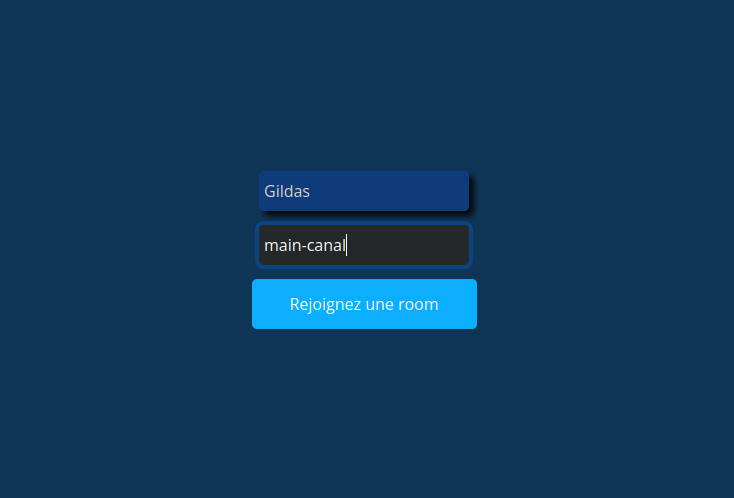
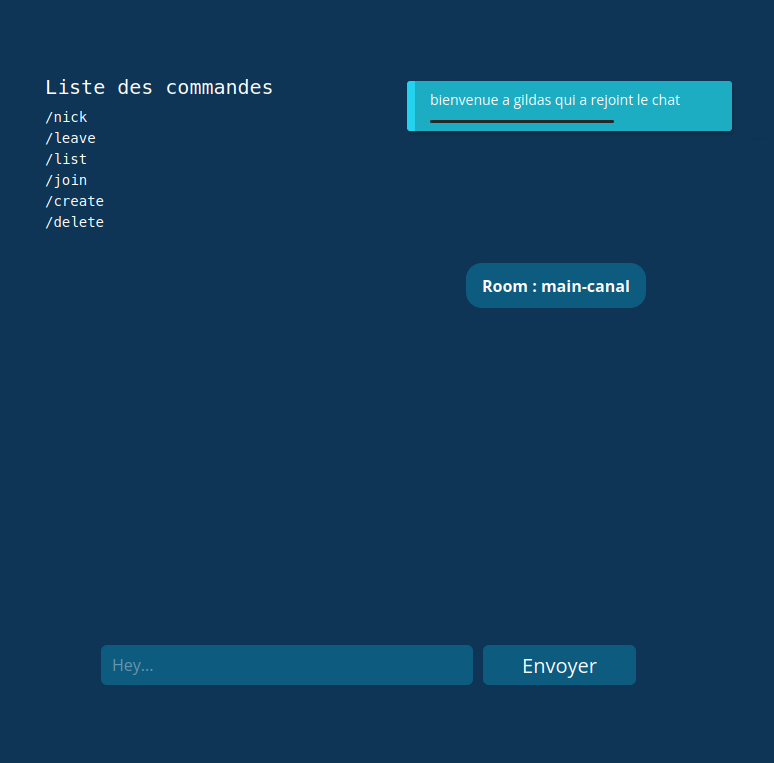

# My_IRC

## Développer un Internet Relay Chat

## Introduction

**Projet d'école réalisé au sein de la W@C**

Serveur IRC avec NodeJS, Express, Socket.io

Le serveur accepte plusieurs connexions simultanées.

Il implémente la notion de "canaux".

Il est possible de rejoindre plusieurs canaux simultanément.

- node.js (node)
- socket.io (web sockets et rooms)
- express.js (node)

## Usage

```shell
cd server &&
npm install && npm run start;
cd client &&
npm install && npm run start;

firefox http://localhost:3000/
```

## Cahier des charges

### Gestion des utilisateurs

- Un système de connexion : l’utilisateur peut se connecter en fournissant un nom d’utilisateur.
- Tous les membres peuvent modifier leurs informations et ajouter des canaux.
- Le membre qui aura créé son canal peut le supprimer et le modifier.

### Gestion des canaux

- Chaque action (création et suppression) sur les canaux et changement de pseudo envoie un message global visible sur tous les canaux.
- Un nouvel utilisateur se connectant à un canal envoie un message visible sur ce canal.
- Les membres connectés à un canal peuvent envoyer un message à tous les utilisateurs de ce canal, et seulement à celui-ci.
- Le serveur maintient à jour la liste des utilisateurs connectés (les sockets) ainsi que des canaux (avec la listes des personnes connectées).

### Commandes

Il est possible d’entrer des commandes dans le chat afin de réaliser différentes actions :

- **/nick** nickname : définit le surnom de l’utilisateur au sein du serveur.
- **/list** [string] : liste les canaux disponibles sur le serveur. N’affiche que les canaux contenant la chaîne "string" si celle-ci est spécifiée.
- **/create** : canal crée un canal sur le serveur.
- **/delete** : canal suppression du canal sur le serveur.
- **/join** : canal rejoint un canal sur le serveur.
- **/leave** : canal quitte le canal.
- **/users** : liste les utilisateurs connectés au canal.
- **/msg** : nickname message: envoie un message à un utilisateur spécifique.
- **/message** : envoie un message à tous les utilisateurs connectés au canal.

```
L’envoi des messages se fait en tapant sur entrée
```

## Demo




